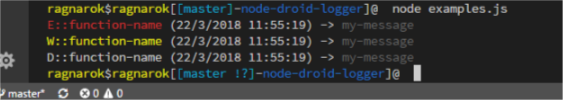

# node-droid-logger
A simple android-style logger for nodejs

## Meaning
This node package is a simple wrapper of console.log, it's not a server log like morgan or others. 
Droid-Logger is built as the android default logger (i.e.`Log.e(TAG, my_message)`) and print  the different 3 types of log (Log.e, Log.d, Log.w)
with 3 differente color

### Installation

    npm install -s droid-logger
After you install the package import in the file where you want to use it

    var Log = require(./droid-logger);

### Usage
Droid-logger has 3 print message mode:

1) `Log.e(<function-name>,<your-message>)` **error log**
2) `Log.d(<function-name>,<your-message>)` **simple debug log**
3) `Log.w(<function-name>, <your-message>)`**warning log**

